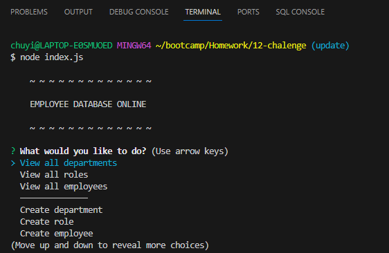

# 12 SQL: Employee Tracker

## Description

A simple CLI where the user can keep track of a list of potential employees. It was a great practice using MySQL and inquirer together. 

## Installation

Install the required packages using npm

## Usage

Run index.js using node to start it up.

https://youtu.be/di3Sb1g5ock

## Credits

Thank you to instructor Trey Eckels for helping me figure things out.

## License

None

## Bonus

Try to add some additional functionality to your application, such as the ability to do the following:

* Update employee managers.

* View employees by manager.

* View employees by department.

* Delete departments, roles, and employees.

* View the total utilized budget of a department&mdash;in other words, the combined salaries of all employees in that department.

## Grading Requirements

> **Note**: If a Challenge assignment submission is marked as “0”, it is considered incomplete and will not count towards your graduation requirements. Examples of incomplete submissions include the following:
>
> * A repository that has no code
>
> * A repository that includes a unique name but nothing else
>
> * A repository that includes only a README file but nothing else
>
> * A repository that only includes starter code

This Challenge is graded based on the following criteria:

### Deliverables: 10%

* Your GitHub repository containing your application code.

### Walkthrough Video: 27%

* A walkthrough video that demonstrates the functionality of the employee tracker must be submitted, and a link to the video should be included in your README file.

* The walkthrough video must show all of the technical acceptance criteria being met.

* The walkthrough video must demonstrate how a user would invoke the application from the command line.

* The walkthrough video must demonstrate a functional menu with the options outlined in the acceptance criteria.

### Technical Acceptance Criteria: 40%

* Satisfies all of the preceding acceptance criteria plus the following:

    * Uses the [Inquirer package](https://www.npmjs.com/package/inquirer/v/8.2.4).

    * Uses the [MySQL2 package](https://www.npmjs.com/package/mysql2) to connect to a MySQL database.

* Follows the table schema outlined in the Challenge instructions.

### Repository Quality: 13%

* Repository has a unique name.

* Repository follows best practices for file structure and naming conventions.

* Repository follows best practices for class/id naming conventions, indentation, quality comments, etc.

* Repository contains multiple descriptive commit messages.

* Repository contains a high-quality README with description and a link to a walkthrough video.

### Application Quality 10%

* The application user experience is intuitive and easy to navigate.

### Bonus

Fulfilling any of the following can add up to 20 points to your grade. Note that the highest grade you can achieve is still 100:

* Application allows users to update employee managers (2 points).

* Application allows users to view employees by manager (2 points).

* Application allows users to view employees by department (2 points).

* Application allows users to delete departments, roles, and employees (2 points for each).

* Application allows users to view the total utilized budget of a department&mdash;in other words, the combined salaries of all employees in that department (8 points).

## Review

You are required to submit BOTH of the following for review:

* A walkthrough video demonstrating the functionality of the application.

* The URL of the GitHub repository, with a unique name and a README describing the project.

- - -
© 2023 edX Boot Camps LLC. Confidential and Proprietary. All Rights Reserved.
